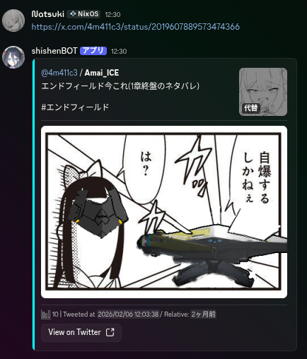

# Super Embed

Super EmbedはX等のリンクをDiscord用の見やすい埋込みに変換するBOTです。

## 参考画像

## 使い方

### 要件

1. java 21

config-example.tomlを参考に、config.tomlを作成し、
tokenにBOTのトークンを入れて`java -jar SuperEmbed-$VERSION$.jar`で起動してください。

# 増やしたい機能

- Xのプロフィール
- Reddit
- Qiita
- Pixiv
- Misskey

# ライセンス

このプロジェクトはISCライセンスの下公開されています。
詳しくは[LICENSE.md](LICENSE.md)を参照してください。

# クレジット

このプロジェクトは以下のOSSがなければ実現できませんでした。

|        プロジェクト名        |                                         ライセンス                                         |                         クレジット                          | 
|:---------------------:|:-------------------------------------------------------------------------------------:|:------------------------------------------------------:|
|         Kord          |           [MIT-License](https://github.com/kordlib/kord/blob/main/LICENSE)            |           [Hope](https://github.com/kordlib)           |
|        Kotlin         |   [Apache-2.0](https://github.com/JetBrains/kotlin/blob/master/license/LICENSE.txt)   |     [JetBrains s.r.o.](https://www.jetbrains.com)      |               
| kotlinx.serialization | [Apache-2.0](https://github.com/Kotlin/kotlinx.serialization/blob/master/LICENSE.txt) |     [JetBrains s.r.o.](https://www.jetbrains.com)      |
|         ktor          |            [Apache-2.0](https://github.com/ktorio/ktor/blob/main/LICENSE)             |     [JetBrains s.r.o.](https://www.jetbrains.com)      |
|         KTOML         |          [MIT-License](https://github.com/orchestr7/ktoml/blob/main/LICENSE)          |    [Andrey Kuleshov](https://github.com/orchestr7)     |
|        shadow         |          [Apache-2.0](https://github.com/GradleUp/shadow/blob/main/LICENSE)           |        [GradleUp](https://github.com/GradleUp)         |
|         slf4j         |        [MIT-License](https://github.com/qos-ch/slf4j/blob/master/LICENSE.txt)         | [QOS.ch Sarl (Switzerland)](https://github.com/qos-ch) | 
|  kotlin-logging-jvm   |       [Apache-2.0](https://github.com/oshai/kotlin-logging/blob/master/LICENSE)       |         [Ohad Shai](https://github.com/oshai)          |